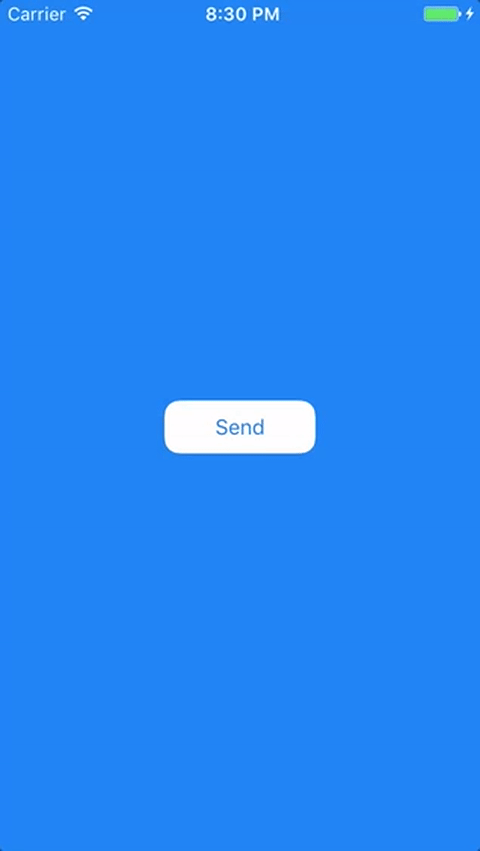

# ProgressButton

Custom button which you can simply use in your projects

1. All you need is to download _folder_ **ProgressButton** and import it to your project
2. Add any _UIButton_ on you controller and make **2x sized hieght** button of **expected height**
2. In Interface Builder assign class to any _UIButton_ as **ProgressButton**
3. Make **IBOutlet** of the button
4. To start animation just call **animate()** method of the button
5. Bind downloaded information to **progress** property

Also you could assign **cornerRadius** property

If you have problems, just look at the example of usage in _ViewController.swift_

Realization of own view on **ProgressButton** of this [gif](https://dribbble.com/shots/2166815-Button-Loading-Animation-with-Framer)
